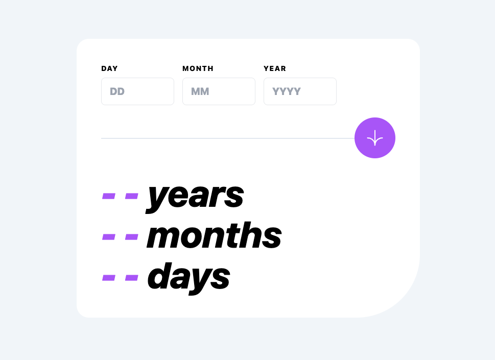

# Frontend Mentor - Age calculator app solution

This is a solution to the [Age calculator app challenge on Frontend Mentor](https://www.frontendmentor.io/challenges/age-calculator-app-dF9DFFpj-Q).

## Table of contents

- [Overview](#overview)
  - [The challenge](#the-challenge)
  - [Screenshot](#screenshot)
  - [Links](#links)
- [My process](#my-process)
  - [Built with](#built-with)
  - [What I learned](#what-i-learned)

## Overview

### The challenge

Users should be able to:

- View an age in years, months, and days after submitting a valid date through the form
- Receive validation errors if:
  - Any field is empty when the form is submitted
  - The day number is not between 1-31
  - The month number is not between 1-12
  - The year is in the future
  - The date is invalid e.g. 31/04/1991 (there are 30 days in April)
- View the optimal layout for the interface depending on their device's screen size
- See hover and focus states for all interactive elements on the page
- **Bonus**: See the age numbers animate to their final number when the form is submitted

### Screenshot

### Links

- Code: [Github](https://github.com/Jwrighty/age-calculator)
- Live Site URL: [Vercel](https://age-calculator-ten-iota.vercel.app/)

## My process

### Built with

- [Vite + React + TS](https://vitejs.dev/)
- [Tailwind CSS](https://tailwindcss.com/)
- [Luxon](https://github.com/moment/luxon) - date & time library
- [React hook form](https://react-hook-form.com/)

### What I learned

Forms and especially validations are tricky & react hook form is cool.
Some more familiarity with Tailwind classes, always useful.
Got to explore Luxon for date & time having previously only really used momemtJS in production apps.
Trying out Vite for the first time. Simple and speedy.
